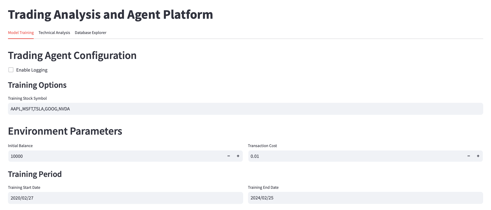
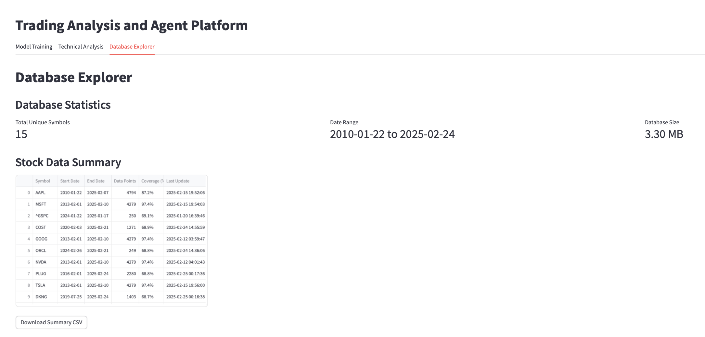
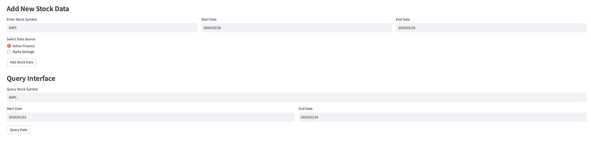
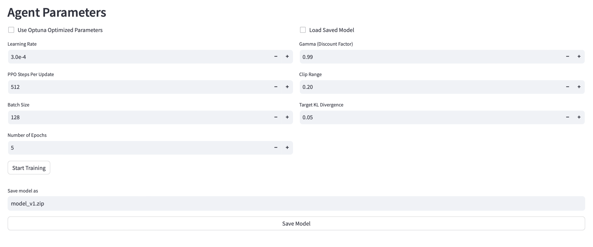
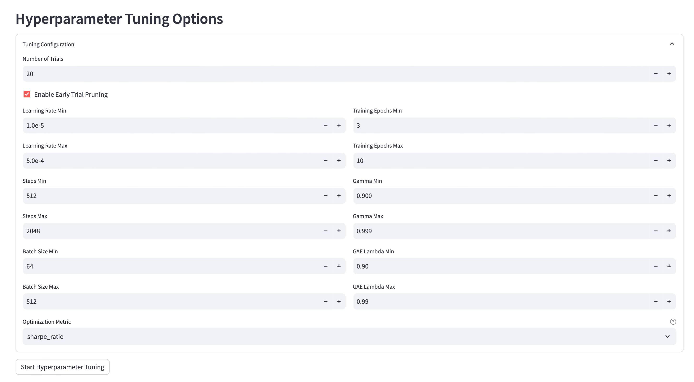

# Advanced Algorithmic Trading Platform

A sophisticated machine learning-based trading platform that leverages reinforcement learning for portfolio optimization and multi-asset trading. Built with Python, this platform combines state-of-the-art ML techniques with comprehensive market analysis tools.

## Core Features

### Trading Engine
- Reinforcement Learning Framework (Gymnasium + Stable-Baselines3)
- Advanced Trading Algorithms (PPO with customizable hyperparameters)
- Multi-Asset Portfolio Management
- Real-time Market Data Integration (Alpha Vantage, Yahoo Finance)
- Transaction Cost Analysis
- Position Sizing and Risk Management

### Analysis & Optimization
- Technical Analysis Dashboard
- Portfolio Performance Metrics
- Hyperparameter Optimization using Optuna
- Automated Feature Engineering
- Custom Reward Function Framework
- Risk-Adjusted Returns Analysis (Sharpe, Sortino, Information Ratio)

### Data Management
- SQL Database Integration
- Market Data Caching
- Real-time Data Streaming
- Feature Engineering Pipeline
- Historical Data Analysis

### Visualization & Monitoring
- Interactive Trading Dashboard (Streamlit)
- Real-time Performance Monitoring
- Technical Indicator Visualization
- Portfolio Analytics Charts
- TensorBoard Integration

## System Architecture

```
├── core/           # Core trading logic and agent implementation
├── environment/    # Trading environment and reward calculation
├── data/          # Data handling and processing
├── metrics/       # Performance metrics and indicators
├── components/    # UI components and visualization
└── utils/         # Utility functions and helpers
```

## Quick Start

1. The platform runs on Replit or in local instance using streamlit.
3. Launch the application locally (from the project root on your laptop):
   ```bash
   streamlit run main.py --server.address 0.0.0.0 --server.port 8501
   ```
   - Open the app at `http://localhost:8501` in your browser. If port `8501` is busy on your machine, change `--server.port` (e.g., `8502`) and use the matching port in the URL.
   - Database note: by default the app uses a local SQLite file; if you want PostgreSQL via Homebrew on macOS, follow `docs/local_db_setup.md`.

## Trading Environment

The platform implements a custom Gymnasium environment with:
- Flexible action space for multiple assets
- Sophisticated reward function incorporating:
  - Portfolio returns
  - Risk metrics
  - Trading costs
  - Position holding incentives
- Configurable observation space with technical indicators
- Built-in transaction cost modeling

## Model Configuration

Key configurable parameters:
- Initial portfolio balance
- Transaction costs
- Position size limits
- Risk management thresholds
- Observation window size
- Training episode length

## Training & Validation Defaults
- **Data split**: 80% training / 20% validation by date with a minimum 30-day train and 7-day validation window.
- **Training schedule**: warm-up phase of 10% of available steps, 256-step episodes, and 3 epochs (adjustable via `schedule_config`).
- **Evaluation**: Validation rollouts every 500 steps with fixed seeds `[7, 21]`, logging PnL, drawdown, turnover, risk ratios, and action/price snapshots to `metrics/metrics_stream.jsonl`.

## Performance Metrics

The platform tracks:
- Total Returns
- Sharpe Ratio
- Sortino Ratio
- Maximum Drawdown
- Information Ratio
- Win Rate
- Position Metrics
- Trading Volume

## Data Sources

Supported data providers:
- Alpha Vantage (real-time and historical)
- Yahoo Finance (historical)
- Custom SQL Database (cached data)

### Downloader interface

Use `StockDownloader` to retrieve both equities and Yahoo Finance option chains from a single interface.
Equities require a start/end date window, while options can target a specific expiration or pull all expirations by default.
Options output includes `Symbol`, `Expiry`, `Strike`, `Type`, `Bid`, `Ask`, `LastPrice`, `Volume`, and `OpenInterest` columns.

```python
from data.stock_downloader import StockDownloader
from datetime import datetime

downloader = StockDownloader(source="yahoo")

# Equities
equity_df = downloader.download_stock_data(
    symbol="AAPL",
    start_date=datetime(2023, 1, 1),
    end_date=datetime(2023, 12, 31),
)

# Options (Yahoo only)
options_df = downloader.download_stock_data(symbol="AAPL", instrument_type="options")
# or target a specific expiry
options_jan_df = downloader.download_options_data(symbol="AAPL", expiry="2024-01-19")
# expiry also accepts datetime/date objects
options_march_df = downloader.download_options_data(symbol="AAPL", expiry=datetime(2024, 3, 15))
```

## Component Details

### Portfolio Manager
- Position tracking
- Trade execution
- Risk monitoring
- Performance calculation

### Rewards Calculator
- Customizable reward functions
- Risk-adjusted returns
- Multi-factor scoring
- Position-based incentives

### Technical Analysis
- Multiple timeframe analysis
- Custom indicator combinations
- Automated signal generation
- Trend identification

## Development

For development and testing:
```bash
python -m pytest tests/ -v
```

Monitor training:
```bash
tensorboard --logdir=tensorboard_logs
```

## Limitations & Considerations

- Market data latency may affect real-time performance
- Model training requires significant computational resources
- Historical data availability varies by asset
- Trade execution assumes ideal market conditions

## Live trading integration overview

If you want to pair this agent with a broker for paper or live trading, see `docs/quantconnect_ibkr_overview.md` for how QuantConnect's Lean engine (data + orchestration) and Interactive Brokers (execution venue) work together to provide recruiter-ready runs. A minimal Lean project scaffold and IBKR adapter utilities live in `integrations/lean_ibkr/`, with a direct IBKR smoke-test script at `scripts/run_ibkr_session.py`.

## Screenshots & Demo

### Model Training Interface

*Main training interface for configuring and training the trading agent*

### Database Explorer

*Database interface showing stock data statistics and summaries*

### Data Query Interface

*Interface for querying and adding new stock data*

### Agent Parameters

*Configurable parameters for the trading agent*

### Hyperparameter Tuning

*Interface for optimizing model hyperparameters*

## License

This project is licensed under the MIT License - see the LICENSE file for details.

Note: This model does not incorportate major feature engineering. It provides the structure 

Requirements: must download dataset from yahoo finance or alpha vantage (free API available), or provide an alternative data source.